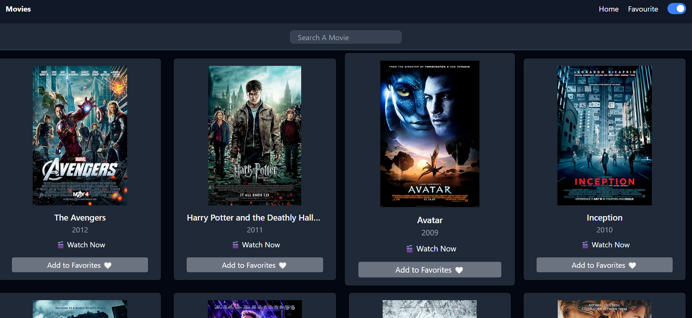

# Movie Discovery Website

A sleek and modern Movie Discovery Website built with React and styled using Tailwind CSS. Explore, search, and favorite your favorite movies with a clean and responsive UI powered by the Omdb API.

## Demo Video

Check out the demo video below to see it in action:

[Watch Demo on LinkedIn](https://www.linkedin.com/posts/arihant-jain-278309260_kanpurinstituteoftechnology-kit-newskillunlocked-activity-7308796071244115968-aKiJ?utm_source=share&utm_medium=member_desktop&rcm=ACoAAEAeIjwB7RwE8NYwFcAOGOtXKu4-_G5Dmlk)

## Screenshot

## Key Features

1. Searching Movies 🎥  
   Instantly search for movies with dynamic results and an interactive UI.

2. Watching Trailers 🎬  
   Watch embedded trailers directly on the site using the powerful TMDb API integration.

3. Favorites System ❤️  
   Save and remove your favorite movies with local storage, ensuring your picks persist between sessions.

4. Dark/Light Mode 🌗  
   Seamless dark/light theme toggle using Tailwind CSS for an enhanced viewing experience.

## Demo Video

Check out the demo video below to see it in action:

(Replace YOUR_VIDEO_ID_HERE with the actual YouTube video ID)

## Tech Stack

- React
- Tailwind CSS
- OMDb API
- Local Storage
- Vite

## How to Run Locally

1. Clone the repository:
   git clone https://github.com/your-username/movie-discovery-app.git
   cd movie-discovery-app

2. Install dependencies:
   npm install

3. Get your Omdb API key:
   - Sign up at https://www.themoviedb.org/
   - Create a .env file in the root directory and add:
     VITE_TMDB_API_KEY=your_api_key_here

4. Start the dev server:
   npm run dev

## Contributing

Feel free to submit issues or pull requests. Contributions are always welcome!

## License

MIT License © Your Name
